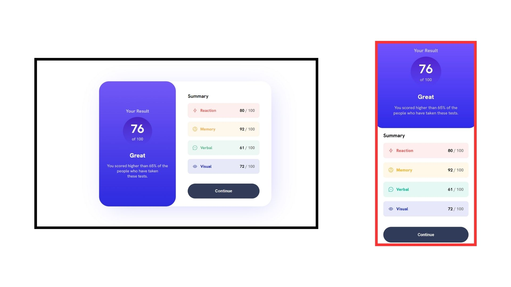

# Frontend Mentor - Results summary component solution

This is a solution to the [Results summary component challenge on Frontend Mentor](https://www.frontendmentor.io/challenges/results-summary-component-CE_K6s0maV).

## Table of contents

- [Overview](#overview)
  - [The challenge](#the-challenge)
  - [Screenshot](#screenshot)
  - [Links](#links)
- [My process](#my-process)
  - [Built with](#built-with)
  - [What I learned](#what-i-learned)
  - [Continued development](#continued-development)
- [Author](#author)

## Overview

### The challenge

Users should be able to:

- View the optimal layout for the interface depending on their device's screen size
- See hover and focus states for all interactive elements on the page
- **Bonus**: Use the local JSON data to dynamically populate the content

### Screenshot

### Links

- Live Site URL: [result-summary-component-ph.vercel.app](https://result-summary-component-ph.vercel.app)

## My process

### Built with

- Semantic HTML5 markup
- CSS custom properties
- Flexbox
- Mobile-first workflow

### What I learned

1. Learned to add `linear-gradient` with 2 colour stops. Realised that I need to use `background` shorthand property to create gradients instead of `background-color`.

2. Practical usage of `inline-block` elements

3. Usage of `:nth-of-type()` selector

4. Set same height to flex columns using `align-items: stretch`

### Continued development

After learning JavaScript I wish to come back to this project and add the data dynamically in HTML from `data.json` file.

## Author

- Website - [Prithwish Hati](https://prithwish.vercel.app)
- LinkedIn - [Prerona (Prithwish) Hati](https://www.linkedin.com/in/prithwishhati)
- Twitter - [@PrithwishHati](https://www.twitter.com/PrithwishHati)
